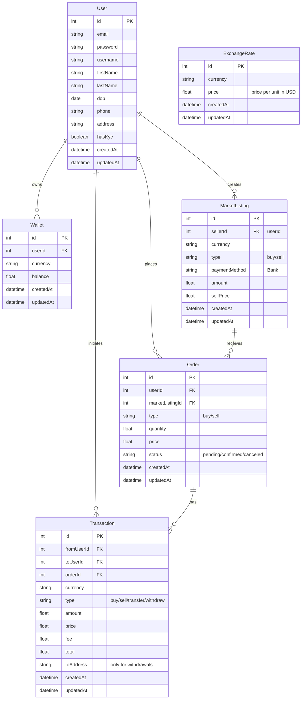

<p align="center">
  <a href="http://nestjs.com/" target="blank"></a>
</p>

[circleci-image]: https://img.shields.io/circleci/build/github/nestjs/nest/master?token=abc123def456
[circleci-url]: https://circleci.com/gh/nestjs/nest

## Description

Cryptocurrencies exchange service e.g https://c2c.binance.com/th/trade/buy/BTC

- ระบบสามารถตั้ง ซื้อ-ขาย Cryptocurrencies (BTC,ETH,XRP, DOGE)
- ระบบบันทึกการโอนเงินและซื้อ-ขายแลกเปลี่ยน
- ระบบมีการสร้างบัญชีผู้ใช้

## Cryptocurrencies exchange ER design



## Installation

```bash
$ yarn install
```

## Set-up database

```bash
# create postgres database
$ docker compose up -d

# create seed data
$ yarn seed
```

## Running the app

```bash
# development
$ yarn run start

# watch mode
$ yarn run start:dev

# production mode
$ yarn run start:prod
```

## Test

```bash
# unit tests
$ yarn run test

# e2e tests
$ yarn run test:e2e

# test coverage
$ yarn run test:cov
```

## License

Nest is [MIT licensed](LICENSE).
